# Veadotube Plugin for Touch Portal

**A plugin to control [Veadotube](https://veado.tube) with [Touch Portal](https://www.touch-portal.com/)!**

_This is an unofficial plugin, please don't harass the devs of either program if you have issues with the plugin_  
_This Plugin is free, but you need to buy the Touch Portal Pro upgrade install and use Plugins_  

## Requirements

- Java 8 Runtime or higher
- Touch Portal (The pro upgrade bought through the Android/iOS Store needed to use Plugins)
- Veadotube Mini v2.0 or higher (Older versions are NOT supported)

## Releases

The latest version is 0.7.1 and currently a beta release.

- Stable enough for general use but hasn't been fully tested.
- Tested with **veadotube mini v2.0a** and **veadotube mini v2.1**

## Getting Help
The easiest way to get help is to ask in the [Touch Portal Discord](https://discord.gg/MgxQb8r) under **Plugins > Streaming** > **Veadotube** 

## Links
- Veadotube: https://veado.tube
- Touch Portal: https://www.touch-portal.com
- BleatKan Library: https://github.com/DissonantAU/bleatkan
- Touch Portal Plugin SDK: https://github.com/ChristopheCVB/TouchPortalPluginSDK

## License
- This Plugin Licensed under GPL v3, and is Free to use in accordance with any Licenses and Agreements 

---

## How to use

### Install Plugin
- Download the latest release from GitHub
- Import the plugin into Touch Portal on the computer Veadotube is running on
  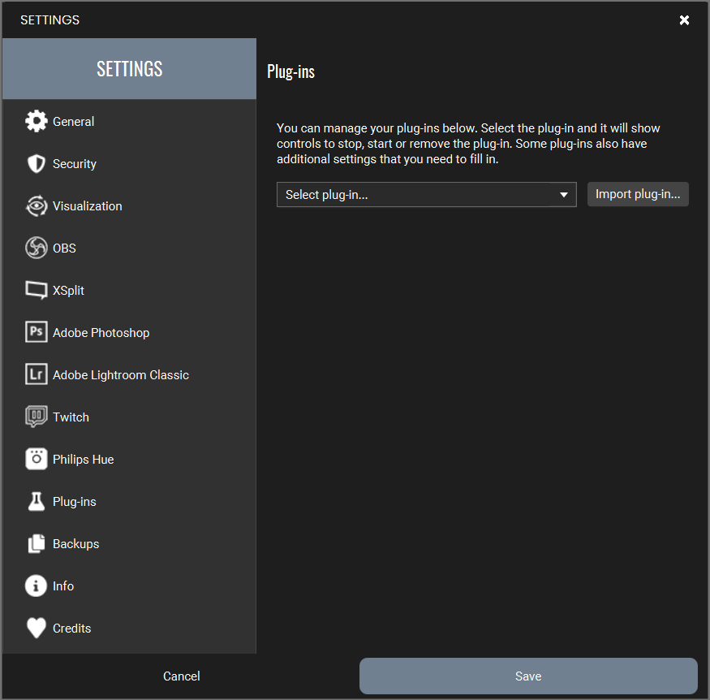
- Touch Portal will show a warning, asking if you want to allow the Plugin to run.  
  Select **Yes** or **Trust Always** to let it run
  **Yes** will make Touch Portal ask you again each time it starts  
  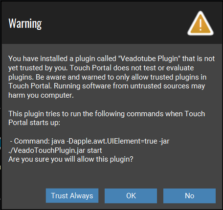

### Plugin Settings
_These are optional, but you may want to enable **Auto Request Current State Thumbnail**_
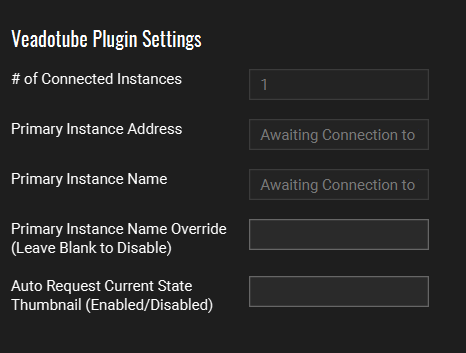

**Primary Instance Name Override**  
If you run more than one copy of Veadotube and have changed the window title, you can enter it here to force the plugin to control it.  
_Note: If nothing is entered, or if no match is found, the **oldest** running window/instance is controlled by default_

**Auto Request Current State Thumbnail**  
If you want a Button to show the thumbnail current Avatar State, type 'enable' and the plugin will fetch it for you

**Example:**  
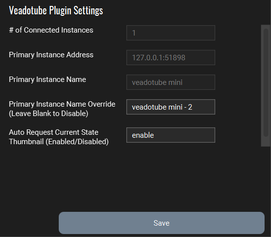

Only one copy of Veadotube Mini is running, it has the default title.  
Enable has been entered for Request Thumbnail

### Setting up Buttons in Touch Portal
**You can find an example Touch Portal Page you can download and import here**  

The example page and the examples below use one of the default avatars, O Gato by BELLA!  
You can find it in Veadotube Mini by clicking _Avatar Settings > Load Default Avatar..._  
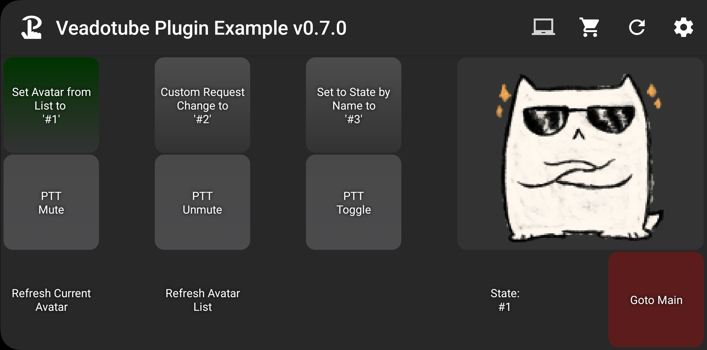

#### Basic Button Setup
The Plugin Actions can be found under **Veadotube - Primary Instance** 

**Basic Avatar Change Trigger**
1. Make sure you have the Avatar you want to use open, and add **Set Avatar State from List** to your button

2. Click the dropdown arrow to show all the current Avatars
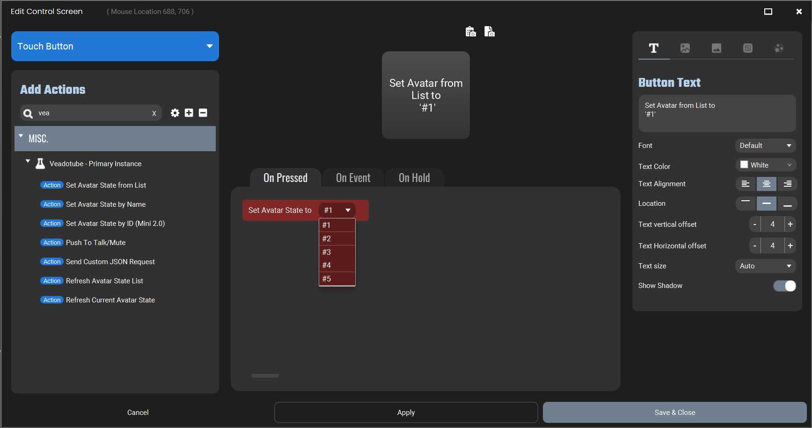

You will see the name, or number assigned by veadotube if you didn't set one.  
Changing the name of a state in veadotube will break your Touch Portal buttons - you will need to come back and update the buttons of any you change.  
- Select the avatar you want this button to set
- Alternatively you can use **Set Avatar State by Name** if you'd prefer to use a text box or value to set the name  
You can copy & paste from the state name filled in veadotube into the text box with this option
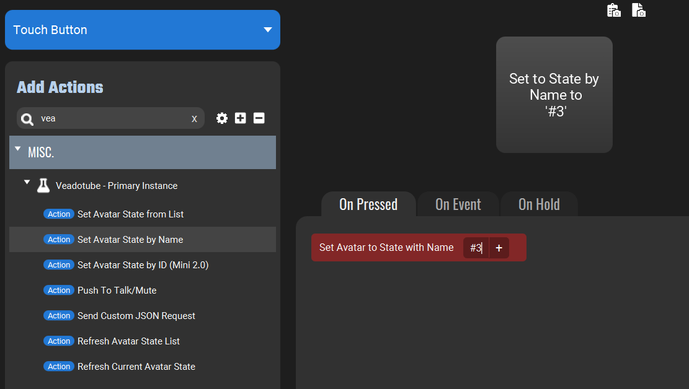

4. Set the Button Text, Background, etc.  
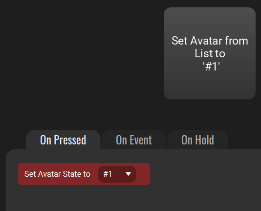

5. Repeat with other buttons

_Opening the avatar state in veadotube shows the name box - you can copy this into Touch Portal text boxes_

You can now press the buttons and change the active avatar!  
Note: Here **When Plug-in state changes** has been used to make the buttons reactive - If you want buttons to change with the state, even when changed directly in veadotube, see under _Advanced Buttons_ below

_After Pressing Button #3_

_After Pressing Button #1_

#### Reactive Buttons
You can set up the buttons to react to the Avatar State Changing - this also works if you change it by clicking directly in Veadotube  

Add:
1. _Event: When Plugin State Changes_  
  Choose _Veadotube Plugin > Primary Instance > Current Avatar State - Name_  

2. Set the 2nd box to 'changes to' and the 3rd to the Avatar Name (you can copy and paste this from veadotube)  

3. Add a _Change Button Visuals_ action inside the event and choose how you want the button to show the Avatar State is active  

4. Copy the _When Plugin State Changes_ event but set the 2nd box to _does not change to_ and add a _Restore button visuals_ action

5. Repeat on your other buttons

Now you can see which avatar is active by the button that's highlighted

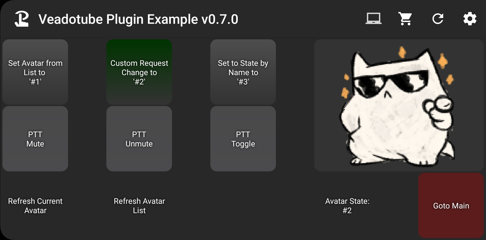
_Avatar State #1 is Active_  

_Avatar State #3 is Active_  

#### Current Avatar as an Icon
If you've enabled _Auto Request Current State Thumbnail_ you can create a 'button' that shows the current Avatar

You can create this by adding:
1. Event: When Plugin State Changes  
   Choose _Veadotube Plugin > Primary Instance > Current Avatar State - Thumbnail_

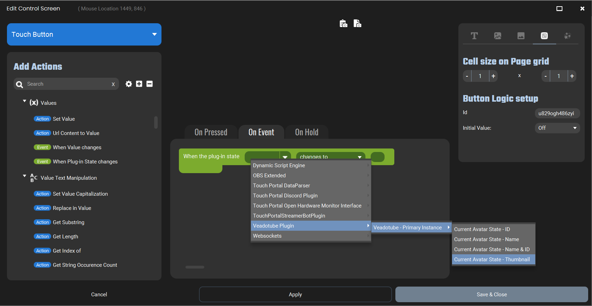

Set the 2nd box to _does not change to_, and leave the 3rd box blank

2. Inside the Event, add _Change visuals by Plugin State_ and select _Icon_ and _Current Avatar State - Thumbnail_  
   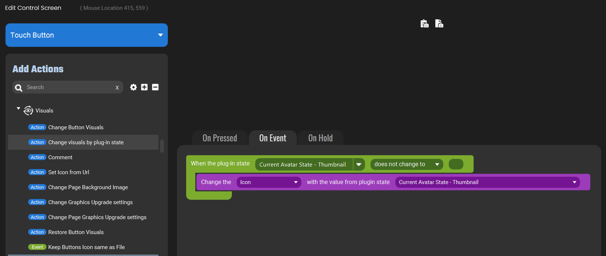

Now the Icon will change when the Avatar does - even if it's changed directly in the app!

#### Show active Avatar State name
You can set a 'button' to show the name of the currently active avatar

Add:
1. _Event: When Plugin State Changes_

Choose _Veadotube Plugin > Primary Instance > Current Avatar State - Name_
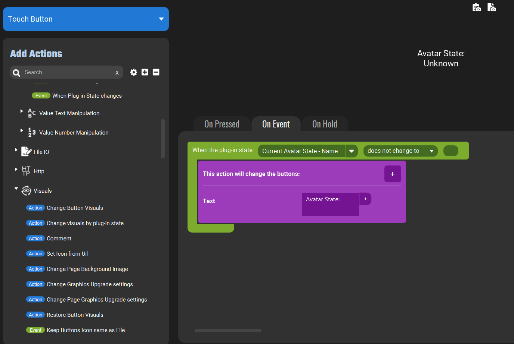

2. Add a _Change Button Visuals_ action inside the event and set it to use the Name to change the button text

_You can add other Text to the change action as well_

The Button should now show the current active Avatar Name

#### Custom JSON Requests
You can send custom JSON Messages to the API, useful if you want to use an API feature that's not supported directly by this plugin
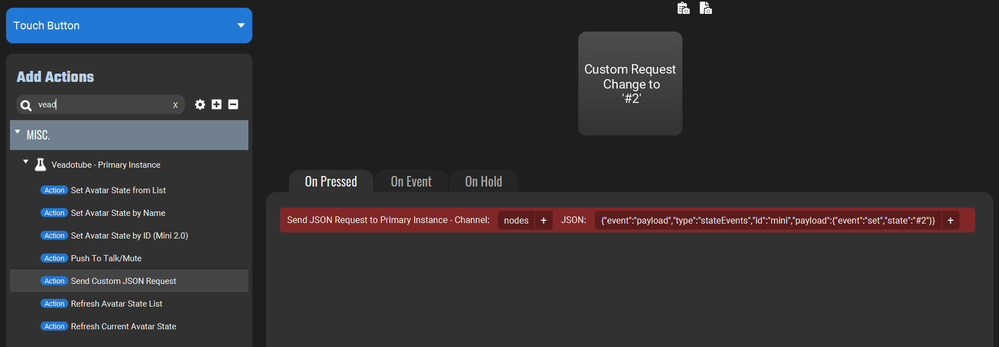
_In this example you can see a Custom JSON Request to set the avatar state to '#2' to be sent to the 'nodes' channel_

#### Refresh Buttons
You can create buttons to Force a refresh as well
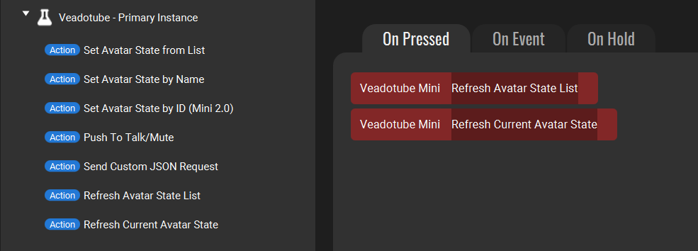  
You won't need these normally, but it can be useful if you're running veadotube mini 2.0a and changing the order/images/names of Avatar States and want to refresh without restarting either Touch Portal of Veadotube.  
From mini 2.1 the Plugin will receive an update if there's a change to any States.
