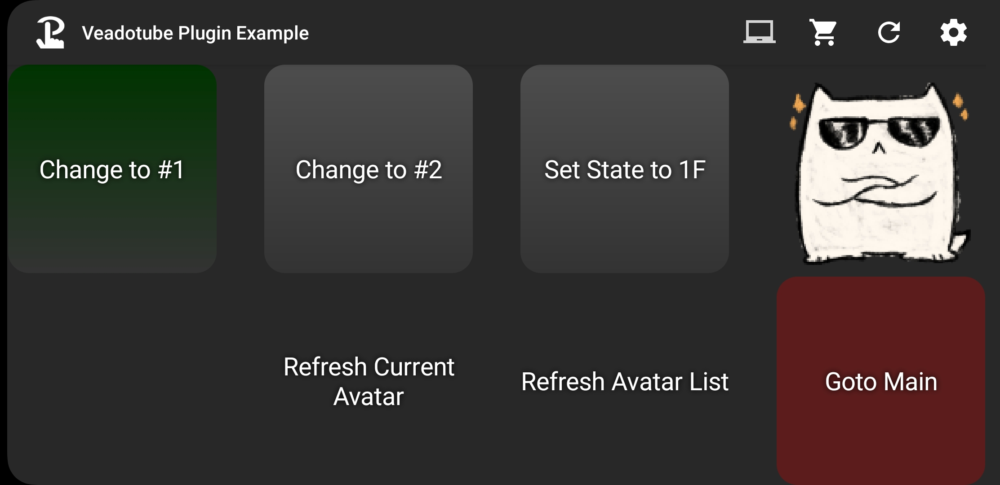

# Veadotube Plugin for Touch Portal

**A plugin to control [Veadotube](https://veado.tube) with [Touch Portal](https://www.touch-portal.com/)!**

_This is an unofficial plugin, please don't harass the devs of either program if you have issues with the plugin_  
_This Plugin is free, but you need to buy the Touch Portal Pro upgrade install and use Plugins_  

## Requirements

- Java 8 Runtime or higher
- Touch Portal (The pro upgrade bought through the Android/iOS Store needed to use Plugins)
- Veadotube Mini v2.0 or higher (Older versions are NOT supported)

## Releases

The latest version is 0.6.0 and currently a beta release.

- Stable enough for general use but hasn't been fully tested.
- Only Tested with **Veadotube Mini v2.0**

## Getting Help
The easiest way to get help is to ask in the [Touch Portal Discord](https://discord.gg/MgxQb8r) under **Plugins > Streaming** > **Veadotube** 

## Links
- Veadotube: https://veado.tube
- Touch Portal: https://www.touch-portal.com
- BleatKan Library: https://github.com/DissonantAU/bleatkan
- Touch Portal Plugin SDK: https://github.com/ChristopheCVB/TouchPortalPluginSDK

---

## How to use

### Install Plugin
- Download the latest release from GitHub
- Import the plugin into Touch Portal on the computer Veadotube is running on
  
- Touch Portal will show a warning, asking if you want to allow the Plugin to run.  
  Select **Yes** or **Trust Always** to let it run
  **Yes** will make Touch Portal ask you again each time it starts  
  

### Plugin Settings
_These are optional, but you may want to enable **Auto Request Current State Thumbnail**_

**Primary Instance Name Override**  
If you run more than one copy of Veadotube and have changed the window title, you can enter it here to force the plugin to control it.  
_Note: If nothing is entered, or if no match is found, the **oldest** running window/instance is controlled by default_

**Auto Request Current State Thumbnail**  
If you want a Button to show the thumbnail current Avatar State, type 'enable' and the plugin will fetch it for you

**Example:**  

Only one copy of Veadotube Mini is running, it has the default title.  
Enable has been entered for Request Thumbnail

### Setting up Buttons in Touch Portal
**You can find an example Touch Portal Page you can download and import here**  

The example page and the examples below use one of the default avatars, O Gato by BELLA!  
You can find it in Veadotube Mini by clicking _Avatar Settings > Load Default Avatar..._  

#### Basic Button Setup
The Plugin Actions can be found under **Veadotube - Primary Instance** 

**Basic Avatar Change Trigger**
1. Make sure you have the Avatar you want to use open, and add **Set Avatar State** to you button

2. Click the dropdown arrow to show all the current Avatars  

You will see the name (or number assigned by Veadotube if you didn't set one) and the Avatar ID in brackets.  
This ID doesn't change and the Plugin uses it, so you can safely change avatar state names in Veadotube without your Touch Portal buttons breaking.  
3. Select the avatar you want this button to set
4. Set the Button Text, Background, etc.  

5. Repeat with other buttons  

_2nd Avatar - no name, given Default of #2. The ID is 'D'_

You can now press the buttons and change the active avatar!  

_After Pressing Button #1_

_After Pressing Button #2_

##### Set Avatar State by ID (Text)
You can also use a text field or Touch Portal Value to set the Avatar

_In this example you can see the state by Text set to 1F (#4). The Set State is shown here for comparison. It's also an easy way to find a State's ID_

#### Refresh Buttons
You can create buttons to Force a refresh as well
  
You won't need these normally, but that can be useful if you're changing the order/images/names of Avatar States and want to refresh without restarting either Touch Portal of Veadotube.  
The Plugin will refresh if it sees a new State ID, but will usually only fetch a list when it first connects

#### Current Avatar as an Icon
If you've enabled _Auto Request Current State Thumbnail_ you can create a 'button' that shows the current Avatar

You can create this by adding:
1. Event: When Plugin State Changes  
Choose _Veadotube Plugin > Primary Instance > Current Avatar State - Thumbnail_

  

Set the 2nd box to _does not change to_, and leave the 3rd box blank

2. Inside the Event, add _Change visuals by Plugin State_ and select _Icon_ and _Current Avatar State - Thumbnail_  

Now the Icon will change when the Avatar does - even if it's changed directly in the app!

#### Advanced Buttons
You can set up the buttons to react to the Avatar State Changing - this also works if you change it by clicking directly in Veadotube  

Add:
1. _Event: When Plugin State Changes_  
  Choose _Veadotube Plugin > Primary Instance > Current Avatar State - ID_  

2. Set the 2nd box to changes to and the 3rd to the Avatar ID (Use the Set Avatar State action to find it if you don't know it already)

3. Add a _Change Button Visuals_ action inside the event and choose how you want the button to show the Avatar State is active  

4. Copy the _When Plugin State Changes_ event but set the 2nd box to _does not change to_ and add a _Restore button visuals_ action  

5. Repeat on your other buttons

Now you can see which avatar is active by the button that's highlighted

_Avatar State #1 is Active_  

_Avatar State #2 is Active_  

#### Show active Avatar State name
You can set a 'button' to show the name of the currently active avatar

Add:
1. _Event: When Plugin State Changes_

Choose _Veadotube Plugin > Primary Instance > Current Avatar State - Name_ or _Name & ID_

2. Add a _Change Button Visuals_ action inside the event and set it to use the Name or Name and ID to change the button text

_You can add other Text to the change action as well_

The Button should now show the current active Avatar Name and/or ID

